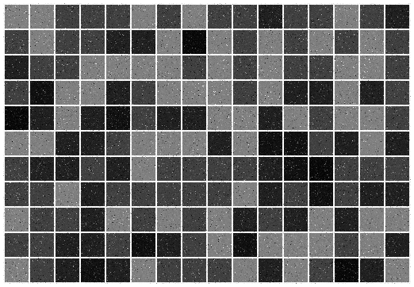

GridTextureGen
==============

This program will generate a grid of shaded and noisy squares to be used as a reliable source of featurepoints
for camera tracking, stereo matching, etc.

Requirements
------------

This project requires OpenCV >2.x

Compiling
---------

The project is included with a simple build script for Linux, but should compile and work fine on Windows or OS X.

Example outputs
---------------

**Unfiltered texture**

**Filtered texture**

License
-------

See LICENSE for details.
